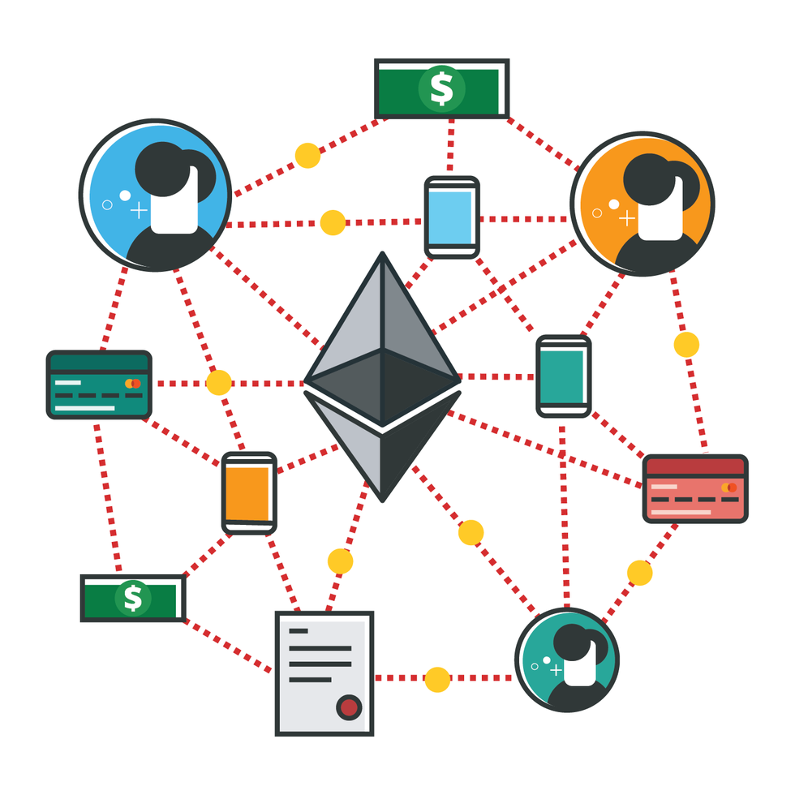
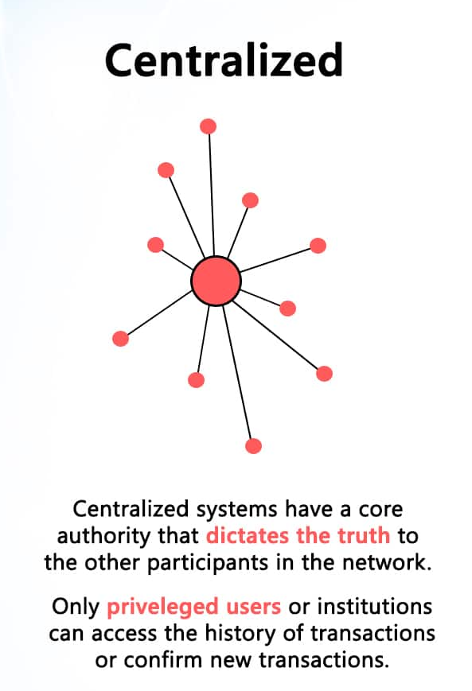
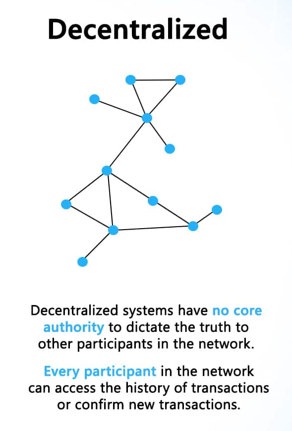
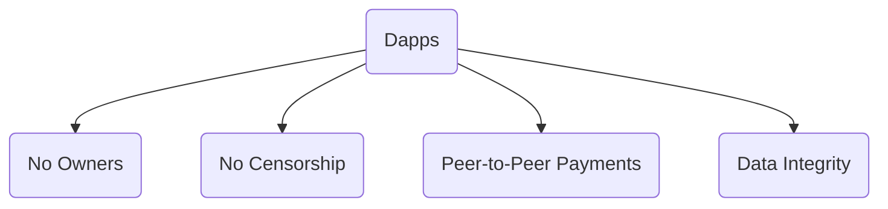
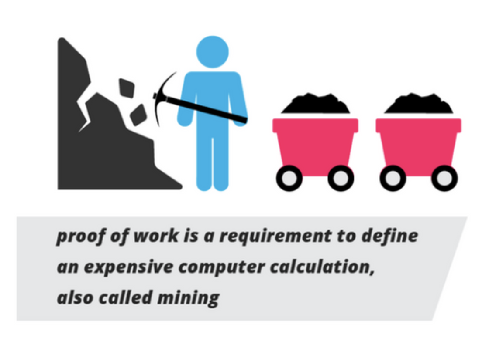
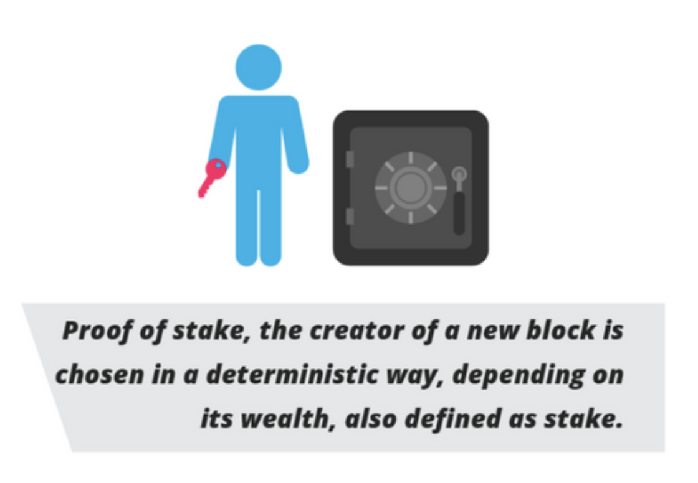

---
# try also 'default' to start simple
theme: unicorn
# random image from a curated Unsplash collection by Anthony
# like them? see https://unsplash.com/collections/94734566/slidev
background: https://source.unsplash.com/collection/94734566/1920x1080
# apply any windi css classes to the current slide
class: 'text-center'
# https://sli.dev/custom/highlighters.html
highlighter: shiki
# show line numbers in code blocks
lineNumbers: false
# some information about the slides, markdown enabled
info: |
  ## Max Mohammadi
  EY Blockchain - Ethereum Introduction)
---

<div class="cover text-center">
  <div class="backdrop-filter backdrop-blur-sm p-10">
    <span class="text-5xl mt--80 mb-4 block font-semibold">Introduction to Ethereum</span>
    <div class="flex justify-center items-center">
      
    </div>
    <span class="block mt-3">A Decentralized Application Platform</span>
  </div>
</div>
<div class="p-1  bg-gradient-to-r from-yellow-500 via-red-500 to-purple-500 absolute bottom-0 right-0 left-0"></div>

---

# Centralized vs. Decentralized

There is almost no activity on the internet that occurs without some kind of intermediary or third party. Large technology corporations can be replaced by Ethereum. Ethereum connects people **directly**, through a powerful decentralized super computer.

<div grid="~ cols-3 gap-20" m="t-1">






</div>

<!--
- Now, you might ask what Ethereum has to do with cryptocurrency. The answer to that lies within Ethereum's ability to store data about transactions & interactions
-->

---
preload: false
---
# Ethereum as Cryptocurrency

* Run on a Blockchain (decentralized, permissionless, verifiable)

* What is the difference between Ethereum and other \
  cryptocurrencies like Bitcoin or Dogecoin?

  * Bitcoin has value because its network can account for transactions, and no transaction data can be manipulated or counterfeited.

  * Ether, or the Ethereum token, has value because the token and transaction data contains computer program code. Unlike Bitcoin's dollar-like token, Ether represents parts of a larger transaction known as a smart contract.

* Anyone can code any application atop the Blockchain, and users pay a fee

* Ether is used as currency to access and participate in the Ethereum ecosystem.


<div class="w-70 relative -mt-10">
  <div class="relative w-30 h-70">
    

  </div>

  <div 
    class="text-5xl absolute top-14 left-40 text-[#2B90B6] -z-1"
    v-motion
    :initial="{ x: -80, opacity: 0}"
    :enter="{ x: 0, opacity: 1, transition: { delay: 2000, duration: 1000 } }">
  </div>
</div>

<!-- vue script setup scripts can be directly used in markdown, and will only affects current page -->
<script setup lang="ts">
const final = {
  x: 0,
  y: 0,
  rotate: 0,
  scale: 1,
  transition: {
    type: 'spring',
    damping: 10,
    stiffness: 20,
    mass: 2
  }
}
</script>

<div
  v-motion
  :initial="{ x:35, y: 40, opacity: 0}"
  :enter="{ y: 0, opacity: 1, transition: { delay: 3500 } }">

</div>


---

# Smart Contracts

* Analagous to vending machines
  * With the right inputs, a certain output is guaranteed
* Contracts have ethereum account addresses, similar to users
  * Contracts are executable programs that require Ether to run --> gas fee to access the Ethereum computer

<div grid="~ cols-2 gap-3" m="t-2">

```solidity
pragma solidity ^0.4.22;

/// Voting with delegation.
contract Ballot {
    struct Voter {
        uint weight;
        bool voted;  // if true, that person already voted
        address delegate; // person delegated to
        uint vote;   // index of the voted proposal
    }

    struct Proposal {
        bytes32 name;   // short name (up to 32 bytes)
        uint voteCount; // number of accumulated votes
    }
}
```

```solidity
pragma solidity ^0.7.6;

contract MyToken is ERC20 {
    constructor (string memory name, 
                string memory symbol) 
                ERC20(name, symbol) {
        // Mint 100 tokens to msg.sender
        // Similar to how
        // 1 dollar = 100 cents
        // 1 token = 1 * (10 ** decimals)
        _mint(msg.sender, 100 * 10 ** uint(decimals()));
    }
}
```

</div>

---
class: px-20
---

# Decentralized Applications - Dapps

Any action on an application can be represented as a transaction. Ethereum not only stores monetary transaction data, but also any kind of transaction data.

* Use cases & examples:
  * Financial instruments (e.g. savings, borrowing, derivatives, etc.)
  * Crop insurance
  * Cloud computing
  * Marketplaces
  * Social media
  * Supply chain management


<div class="grid grid-cols-0 gap-10 pt-5 mb-10">




</div>

---
preload: false
---

# How is Ether Created?

* ETH is generated by the Ethereum protocol as a reward to users who expend their computational resources (e.g. CPU, GPU, ASICS, etc.)

* Mining ETH is a mechanism by which transactions can be verified and accounted for across the blockchain

<br/>

### Consensus Mechanisms:
<br/>
<div grid="~ cols-2 gap-3" m="-t-2" align="center">

Proof of Work

Proof of Stake





</div>

---

# How to Use Ethereum

* Using Applications:
  * Users can access the decentralized web, or Web 3.0, and use internet Dapps by connecting with their cryptocurrency wallet
  * Manage personal/business finances with decentralized tools such as Aave, Uniswap, Yearn, Compound, Bancor, Curve, etc.
  * Usage requires ETH or Ethereum compatible tokens as payment for these protocols and apps

<br/>

* Developing applications:
  * Ethereum provides the base layer of building blocks for creating Dapps
  * Solidity programming + Javascript + Web development frameworks/languages = Web 3.0
  * Create APIs from existing Ethereum lego building blocks

<br/>

* Passive:
  * Price speculation on Ethereum or Ethereum compatible tokens
  * Investing and trading


---

# References

| Links       |
| ----------- |
| [Ethereum Whitepaper](https://ethereum.org/en/whitepaper/)      |
| [99Bitcoins Ethereum Video](https://www.youtube.com/watch?v=jxLkbJozKbY)   |
| [Blockgeeks Blockchain Infographics](https://blockgeeks.com/blockchain-infographics/)   |
| [How does Ethereum work, anyway?](https://preethikasireddy.medium.com/how-does-ethereum-work-anyway-22d1df506369)   |


<!-- 

Before we dive into what ethereum is, we need to understand the fundamental difference between centralized systems and decentralized systems. 

Today, most systems including internet, mobile phone networks, political governance, legal system, monetary system, and so on, are all centralized, meaning that there are instituations and organziations that have hundreds or thousands of professionals working together to maintain and organize their system. 

Decentralizing all these systems has been thought of before, but it has not been a viable option until now. If you were to remove the entire government and let everyone govern themselves, there would be anarchy. However, if you have extreme levels of centralization, you will end up with authoritarian systems that dictate what is true and what is allowed

Ethereum can help solve this problem! Ethereum is a decentralized computer that is made up of thousands of machines across the world. The computing power of this system is as large as tech giants such as amazon, google, or microsoft. Ethereum's vision is that of replacing the need to rent out server storage or computational power from intermediaries, and instead create a world where anyone with internet can get those resources too. Ethereum has a couple additional features that we will go over in a minute here. 

So, where does the idea of money come into all this?

-->

